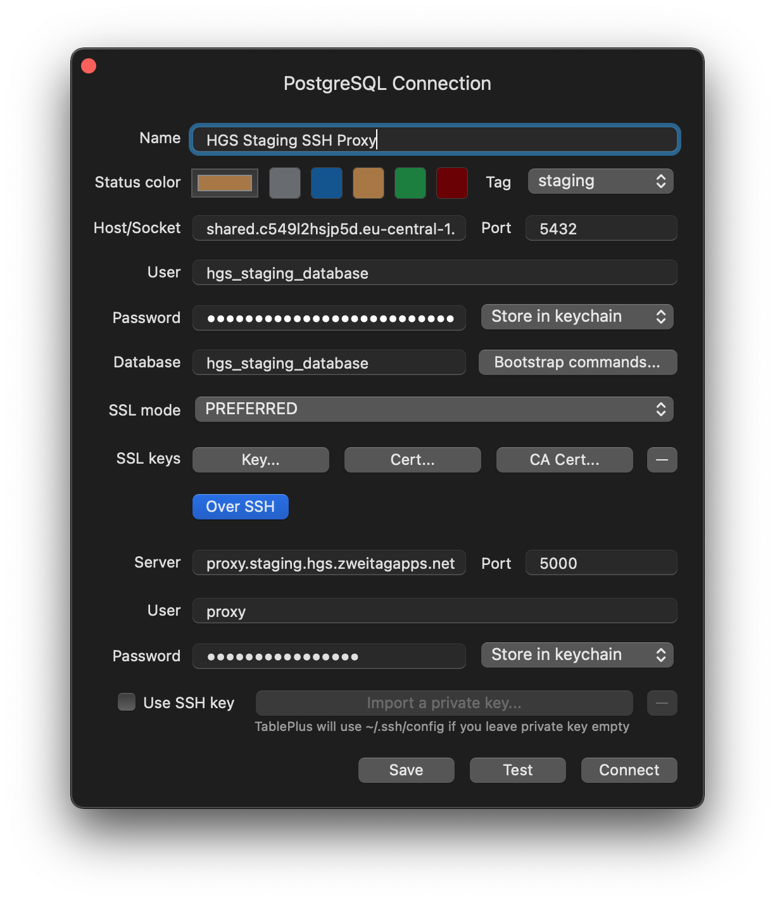
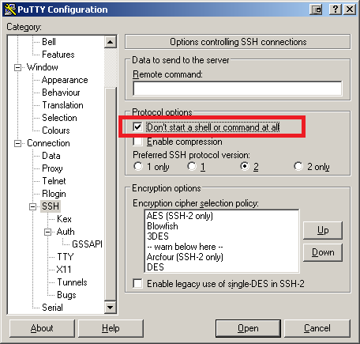

# SSH Database Proxy

This is an example of deploying an SSH Database Proxy application on SetOps using [openSSH](https://www.openssh.com/). If you want your Database to get accessed securely from outside SetOps, you can use this SSH proxy for that purpose. In case another SetOps app like a background job needs access to the Database, use the [`link`](https://docs.setops.co/latest/user/configuration/services/#link-service-to-app) option instead.

## Setup

1. Create the app and make it public available via tcp. Only do a changeset commit after you set the protocol. Otherwise the protocol is set to `http` and cannot be changed anymore.

    ```shell
    setops -p <PROJECT> -s <STAGE> app:create proxy

    setops -p <PROJECT> -s <STAGE> --app proxy network:set protocol tcp
    setops -p <PROJECT> -s <STAGE> --app proxy network:set public true
    ```

1. Link the existing Database to the proxy app:

    ```shell
    setops -p <PROJECT> -s <STAGE> --app proxy link:create database --env-key DATABASE_URL
    ```

1. Set the environment variables:

    ```text
    SSH_HOST_KEY: <see hint>
    SSH_PASSWORD: <see hint>
    NO_VHOST: '1'
    (optional) SSH_AUTHORIZED_KEYS: <see hint>
    ```

    > Hint:
    >
    > `SSH_HOST_KEY`: SSH server host key (generate with `ssh-keygen -t rsa -b 4096 -f key` without passphrase), encode to base64 with `base64 --break=0 < key`
    >
    > `SSH_PASSWORD`: random 16 character password (generate with `pwgen 16 1`)
    >
    > `SSH_AUTHORIZED_KEYS`: SSH public keys files, encode to base64 with `base64 --break=0 < authorized_keys`

    Use the `setops -p <PROJECT> -s <STAGE> --app proxy env:set <var>:<value>` to set the values. The port of the proxy server and the forward database host and port are gathered by using the `$PORT` and `$DATABASE_URL` environment variables.

1. Build & Deploy the proxy using:

    ```shell
    docker build -t <CLIENT>.setops.net/<PROJECT>/<STAGE>/proxy .
    docker push <CLIENT>.setops.net/<PROJECT>/<STAGE>/proxy

    setops -p <PROJECT> -s <STAGE> --app proxy release:create sha256:<sha>
    setops -p <PROJECT> -s <STAGE> --app proxy release:activate 1
    ```

## Connection

To connect to the ssh-server, use the following settings:

- Server: run `sos --app proxy domain` to get the domain
- User: `proxy`
- Password: see environment variable `SSH_PASSWORD`
- Port: see App Network Port (`app:info proxy`, default `5000`)

To connect to the database, extract the following values from the `DATABASE_URL` environment variable:

- Host
- Port
- User
- Password
- Database

An example connection using using [Table Plus](https://www.tableplus.io/download) can be found in the picture below:



If using PuTTY, remember to set the following option:


